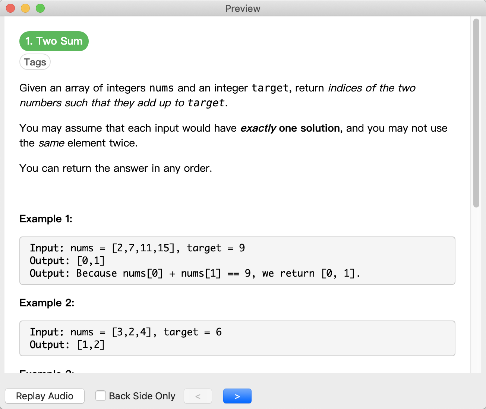
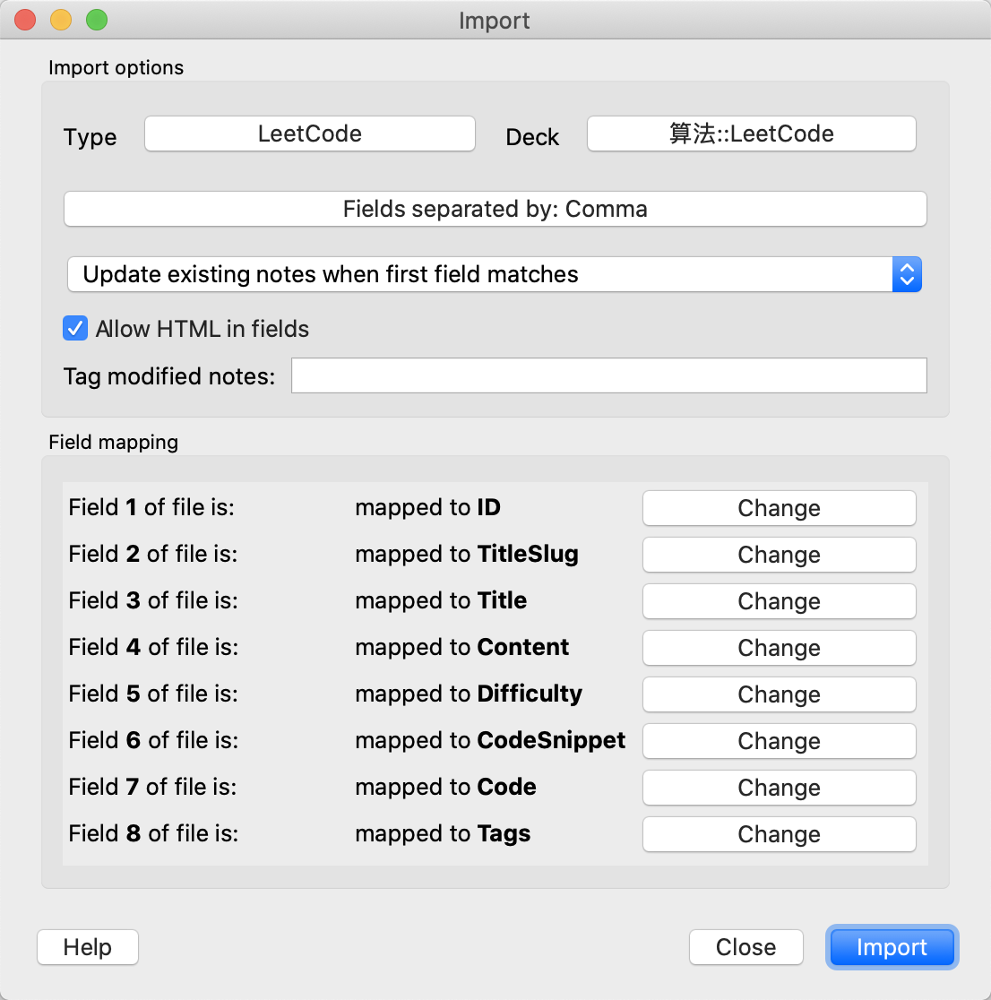

# lc2anki

lc2anki 是一个为 LeetCode 生成 Anki 卡片的工具。仅题目，无题解。

卡片模板来自：<https://github.com/invzhi/LeetCode>



## 使用

### 1. 生成卡片

```sh
$ python3 lc2anki.py -h
usage: lc2anki [OPTION]...

lc2anki is a tool generating Anki cards for LeetCode.

optional arguments:
  -h, --help            show this help message and exit
  -l LANG, --lang LANG  specify language, for example: C, C++, Java
  -o FILE, --output-file FILE
                        set output file
  -d, --debug           show debug info

question options:
  -u URL, --url URL     generate cards from link, for example: https://leetcode.com/tag/array/, https://leetcode.com/problemset/top-100-liked-questions/,
                        https://leetcode.com/list/foobar/, https://leetcode.com/problem-list/93afdecd8402495fa94c8fb4b98be8fd
  -q [QUESTION ...], --question [QUESTION ...]
                        specify question id or title slug, for example: 1, two-sum, 1-100
  -i FILE, --input-file FILE
                        specify question ids or titles from FILE split by lines
```

#### 示例

指定 url：

```sh
$ python3 lc2anki.py --lang Python3 --url https://leetcode.com/problem-list/93afdecd8402495fa94c8fb4b98be8fd
$ python3 lc2anki.py -l Java -u https://leetcode.com/tag/array/
```

指定题目：

```sh
$ python3 lc2anki.py --question 1
$ python3 lc2anki.py -q 1 2 3
$ python3 lc2anki.py -q 1-100
$ python3 lc2anki.py -q 1 2 3-100
$ python3 lc2anki.py -q two-sum
$ python3 lc2anki.py -q "Add Two Numbers"
$ python3 lc2anki.py -q two-sum "Add Two Numbers" 3-100
```

用文件指定题目：

```sh
$ cat q.txt
two-sum
Add Two Numbers
3-100
$ python3 lc2anki.py -i q.txt
```

### 2. 添加笔记类型

添加笔记类型“LeetCode”。

设置卡片模板，[正面模板](template/front-template.html)、[背面模板](template/back-template.html)和[样式](template/styling.css)。

设置字段：


### 3. 导入卡片


